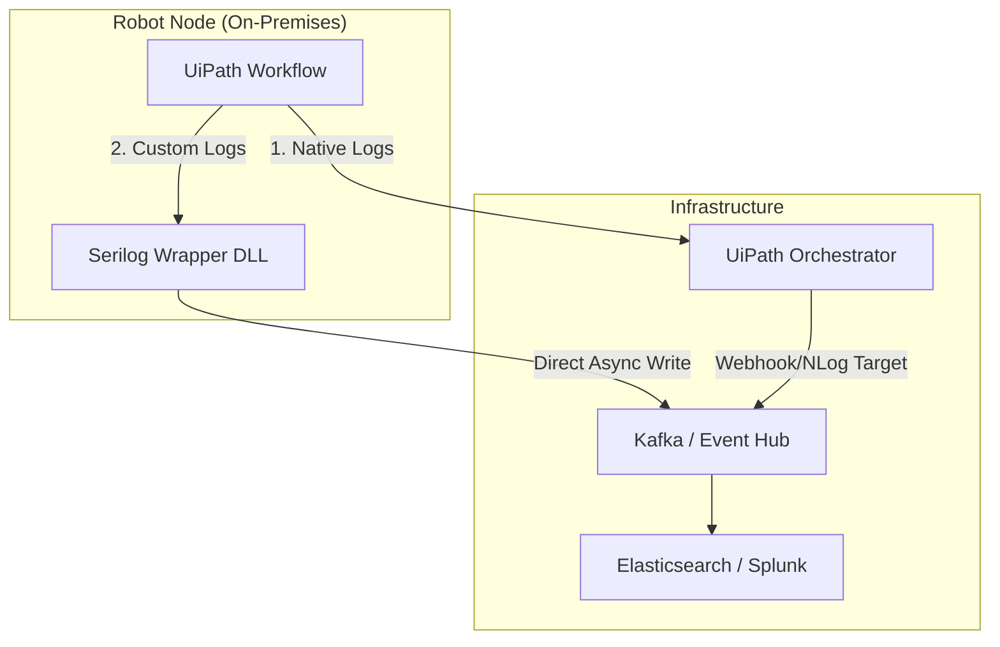

# ISSUE_10: UiPath 自定義 Serilog 整合深度研究報告

**文件狀態**：草案 (Draft)  
**編寫人員**：應用整合科長  
**日期**：2026-02-07  
**專案**：可觀測性研究 (Observability Research)

---

## 1. 研究目標

UiPath 原生的日誌系統（透過 `Log Message` 活動）主要依賴 NLog 配置，且其欄位高度固定（如 `Message`, `Level`, `Timestamp`, `ProcessName` 等），難以靈活擴展業務自定義欄位（如 `OrderNumber`, `CustomerType`）。

本研究旨在突破此限制，透過開發 **Serilog Wrapper DLL**，將 .NET 生態中強大的結構化日誌能力導入 UiPath，確保自動化流程的日誌格式與公司內部 .NET 微服務系統高度一致，提升跨系統的日誌檢索效率與關聯分析能力。

---

## 2. UiPath 與外部 .NET DLL 呼叫機制

UiPath 運行於 .NET 環境，與外部 DLL 的整合主要有兩種途徑：

### 2.1 Invoke Method (直接呼叫)
- **機制**：將封裝好的 DLL 置於機器人節點的依賴路徑，或透過 `Import` 命名空間後，直接在 Workflow 中使用 `Invoke Method` 活動呼叫靜態方法。
- **優點**：部署快速，不需封裝為 NuGet 套件。
- **缺點**：缺乏開發時的型別提示，維護性較差。

### 2.2 Custom Activity (NuGet 封裝 - 推薦)
- **機制**：使用 Visual Studio 配合 `UiPath.Activities.SDK` 將 DLL 封裝為 `.nupkg` 套件。
- **優點**：
    - 整合至 UiPath Studio 的 Activities 面板。
    - 支援強型別參數與預設值。
    - 版本管理便利，透過 Orchestrator 自動發送至 Robot 節點。

---

## 3. 實作範例：符合 Eric 規範的 Serilog Wrapper

為了符合開發主管 Eric 對於日誌規範的要求（如：強制包含 `AppID`, `Environment`, `Version`），建議採用的封裝結構如下：

### C# 封裝範例 (Eric.Logging.Serilog)

```csharp
using Serilog;
using System;

namespace Eric.Logging.UiPath
{
    public static class SerilogLauncher
    {
        private static ILogger _logger;

        // 初始化全域 Logger (建議在 Main 的 First Run 執行)
        public static void InitLogger(string sinkUrl, string appId, string env)
        {
            _logger = new LoggerConfiguration()
                .MinimumLevel.Debug()
                .Enrich.WithProperty("AppID", appId)
                .Enrich.WithProperty("Environment", env)
                .Enrich.FromLogContext() // 支援動態屬性
                .WriteTo.Console()
                .WriteTo.Http(sinkUrl) // 範例：寫入外部 API Sink
                .CreateLogger();
        }

        // 結構化日誌方法
        public static void LogInfo(string message, string correlationId, object businessData)
        {
            _logger.Information("{@BusinessData} [CorrelationID: {CorrelationID}] {Message}", 
                businessData, correlationId, message);
        }
    }
}
```

---

## 4. Workflow 中的 CorrelationID 自動傳遞

為了在異構系統間追蹤請求，`CorrelationID` 的一致性至關重要。

### 4.1 利用 Global Exception Handler 或 Arguments
1. **初始化階段**：在 `Main.xaml` 開始處生成 `GUID` 並賦值給 `str_CorrelationID`。
2. **自動傳遞策略**：
    - **自定義活動 (Custom Activity)**：繼承 `CodeActivity`，在內部隱式讀取全域變數或透過 `InArgument` 強制要求輸入。
    - **Invoke Method**：封裝一個 `LogProvider.SetCorrelationID(id)` 的靜態方法，存於執行緒當下的 `LogicalCallContext` 或靜態變數中，隨後的 Log 呼叫自動附加該 ID。

---

## 5. 架構圖：Orchestrator Log 導向外部 Sink

傳統路徑為 `Robot -> Orchestrator -> SQL Server/Elasticsearch`。為了實現更靈活的觀測，建議採用的架構如下：



*註：建議將 Custom Logs 直接導向 Sink (如 Kafka)，避開 Orchestrator 的資料庫效能瓶頸。*

---

## 6. 給 Eric 的實作建議（針對穩定性考量）

針對 **On-premises** 機器人節點，實作時須特別注意以下穩定性原則：

1. **非同步日誌 (Async Sinks)**：
   - 務必配置 `WriteTo.Async()`。若外部 Sink (如 Kafka 或 API) 暫時斷線，不應阻塞機器人自動化流程的執行。
2. **本地緩衝機制 (Local Buffer)**：
   - 使用 `Serilog.Sinks.File` 並配置 `Buffered = true` 作為 Fallback 機制。當網路異常時，先寫入本地磁碟，待恢復後再補傳。
3. **依賴管理**：
   - 避免將過多複雜的 .NET 依賴直接塞入 DLL。建議維持 Wrapper 的輕量化，避免與 UiPath 內建的 `Newtonsoft.Json` 或 `RestSharp` 版本衝突。
4. **資源釋放 (Flush)**：
   - 在流程結束或發生 Unhandled Exception 時，必須顯式呼叫 `Log.CloseAndFlush()`，確保緩衝區內的日誌不丟失。

---

**結論**：透過封裝 Serilog Wrapper，我們不僅能滿足結構化日誌的需求，還能建立起與 .NET 核心系統通用的 Observability 標準，這對於後續處理複雜的跨平台排錯有著極大助益。
